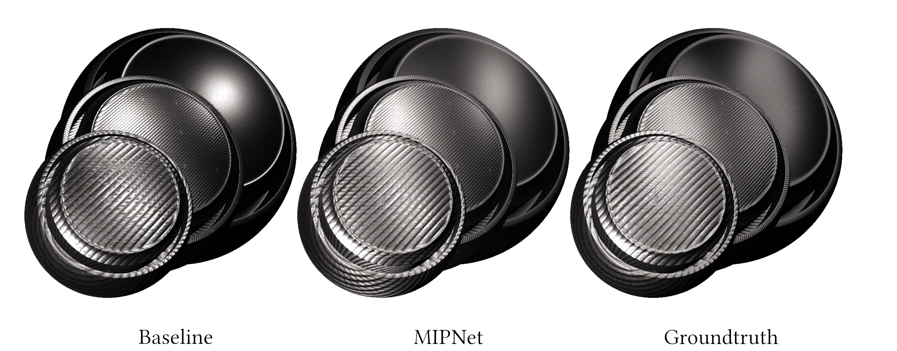

## MIPNet: Neural Normal-to-Anisotropic-Roughness MIP mapping



**MIPNet: Neural Normal-to-Anisotropic-Roughness MIP mapping**<br>
[Alban Gauthier](https://albangauthier.github.io), 
[Robin Faury](https://research.adobe.com/person/robin-faury/), 
[Jérémy Levallois](https://research.adobe.com/person/jeremy-levallois/), 
[Théo Thonat](https://research.adobe.com/person/theo-thonat/), 
[Jean-Marc Thiery](https://research.adobe.com/person/jean-thiery/), 
[Tamy Boubekeur](https://perso.telecom-paristech.fr/boubek/) <br>
*ACM Transaction on Graphics (proceedings of SIGGRAPH Asia 2022)* <br>
### [Project page](https://perso.telecom-paristech.fr/boubek/papers/MIPNet/) | [Paper](https://dl.acm.org/doi/pdf/10.1145/3550454.3555487) | [Presentation](https://www.youtube.com/watch?v=Pij9z3auXsc) | [ACM Digital Library](https://dl.acm.org/doi/abs/10.1145/3550454.3555487)

---

## Citation
```
@article{Gauthier_2022_MIPNet,
author = {Gauthier, Alban and Faury, Robin and Levallois, J\'{e}r\'{e}my and Thonat, Th\'{e}o and Thiery, Jean-Marc and Boubekeur, Tamy},
title = {MIPNet: Neural Normal-to-Anisotropic-Roughness MIP Mapping},
year = {2022},
issue_date = {December 2022},
publisher = {Association for Computing Machinery},
address = {New York, NY, USA},
volume = {41},
number = {6},
journal = {ACM Trans. Graph.},
month = {nov},
articleno = {246},
numpages = {12}
}
```

## Table of Contents

- [Usage](#usage)
	- [Requirements](#requirements)
	- [Training and Evaluation](#training-and-evaluation)
	- [Viewer](#mipnet-viewer)
- [License](#license-mit)
- [Acknowledgment](#acknowledgment)

## Usage

### Requirements

#### Using Conda

Download the miniconda tool: https://docs.conda.io/en/latest/miniconda.html  
Open the Anaconda prompt tool

```
  cd mipnet_neural_mipmap
  conda create --name mipnet python=3.9
  conda activate mipnet
  conda install pytorch torchvision torchaudio cudatoolkit=11.3 -c pytorch
  conda install -c conda-forge openexr-python opencv
  pip install matplotlib tqdm
```

#### Using pip

```
 pip3 install torch==1.10.0+cu113 torchvision==0.11.1+cu113 torchaudio==0.10.0+cu113 -f https://download.pytorch.org/whl/cu113/torch_stable.html
 pip3 install matplotlib tqdm opencv-python OpenEXR
```

### Training and Evaluation

#### Training setup

The training folder can be named "data" and have the following content:  
(See the option : --data-path, --train-file)  

- mipnet_neural_mipmap/
  - data/
    - materials1K_train/
      - material001/
        - baseColor.png
        - metallic.png
        - height.png
        - normal.png
        - roughness.png
      - material002/
        - baseColor.png
        - metallic.png
        - height.png
        - normal.png
        - roughness.png

#### Training

Example usage for training:
```
python main.py --mode train --data-path "./data/" --train-file mat_train.txt --output-dir "./results/test_01/" --num-epochs 10 
```

*mat_train.txt* contains the path to multiple materials to use as training data.

#### Inference

Example usage for inference:
```
python main.py --mode eval --data-path "./data/" --eval-file mat_eval.txt --model-path "./results/test_01/" --model-index 10
```

*mat_eval.txt* contains the path to multiple materials to use as test data.

#### Options

Useful options:
```
--eval-after-training :   launch inference on training data after training ends
--output-maps-pyramid :   outputs the mipmap pyramids for normal and anisotropic coefficients
--eval-compute-flip :     comupute flip error between reference renderings, baseline and MIPNet maps
--train-opengl-normals :  train using OpenGL normal maps
```

Unfortunately, no learned model can be provided since proprietary data have been used for creating results in the paper.

### MIPNet Viewer

To be released soon
<!-- See README.md in the viewer folder. -->

## License (MIT)

```
Copyright (c) 2022 - Télécom Paris - Alban Gauthier

Permission is hereby granted, free of charge, to any person obtaining a copy
of this software and associated documentation files (the “Software”), to
deal in the Software without restriction, including without limitation the
rights to use, copy, modify, merge, publish, distribute, sublicense, and/or
sell copies of the Software, and to permit persons to whom the Software is
furnished to do so, subject to the following conditions:

The above copyright notice and this permission notice shall be included in
all copies or substantial portions of the Software.

The Software is provided “as is”, without warranty of any kind, express or
implied, including but not limited to the warranties of merchantability,
fitness for a particular purpose and non-infringement. In no event shall the
authors or copyright holders be liable for any claim, damages or other
liability, whether in an action of contract, tort or otherwise, arising
from, out of or in connection with the software or the use or other dealings
in the Software.
```

### Acknowledgment

Thanks to Nvidia and the FLIP paper team for releasing their code publicly. Thanks to John Burkardt for the sphere fibonacci code.